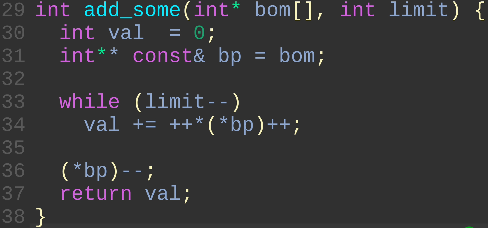

## Question


## Answer
Error:
1. Read-only reference can not be incremented
2. Error in passing multidimensional array to multidimensional pointer

```
Error: error: cannot convert 'int (*)[1]' to 'int**' for argument '1' to 'int add_some(int**, int)'
```

## pass by reference (&)

```c++
#include<iostream>
int add_some(int &);

int main(){
  int a = 10;
  printf("%d\n",a);
  add_some(a);
}

int add_some(int & b){
  b++;
  printf("b=%d\n",b);
  
}
```

#### Output
```
b = 11
a = 11
```

## read only reference
```c++
#include<iostream>
int add_some(int &);

int main(){
  int a = 10;
  printf("%d\n",a);
  add_some(a);
}

int add_some(int & b){
  b++;
  printf("b=%d\n",b);
  
}
```
### output
```
  error: (b++) not allowed in read only reference
```


## passing array 
```c++
#include<iostream>
int add_some(int [], int);
void display(int [],int);

int main(){
  int limit = 4;
  int a[] = {10,20,30,40};
  add_some(a, limit);
  printf("a[]\n");
  display(a, limit);
}

int add_some(int b[], int limit){
  printf("b[]\n");
  display(b, limit);
}


void display(int array[], int limit){
    for (int i=0; i< limit; i++)
    printf("\telement %d = %d\n",i,array[i]);
}
```

### Output
```
b[]
	element 0 = 10
	element 1 = 20
	element 2 = 30
	element 3 = 40
a[]
	element 0 = 10
	element 1 = 20
	element 2 = 30
	element 3 = 40
```  

## Modifying array
```c++
int main(){
  int limit = 4;
  int a[] = {10,20,30,40};
  add_some(a, limit);
  printf("a[]\n");
  display(a, limit);
}

int add_some(int b[], int limit){
  int sumVal = 0;
  for (int i=0; i < limit; i++)
    sumVal += ++b[i];
  printf("b[]\n");
  display(b, limit);
  printf("Sum = %d", sumVal);
}


```
### output
```
b[]
	element 0 = 11
	element 1 = 21
	element 2 = 31
	element 3 = 41
Sum = 104
a[]
	element 0 = 11
	element 1 = 21
	element 2 = 31
	element 3 = 41
```

## array reference
```c++
  int * & bp = b;
  while (limit--)
    sumVal += ++*(bp++);
```

### output
same 

## read only reference
```c++
  int * const& bp = b;
  while (limit--)
    sumVal += ++*(bp++);
```
### output
```
error: increment of read-only reference 'b'
```

## Two dimensional array
```c++
#include<iostream>
int add_some(int [][1], int);
void display(int [], int);

int main(){
  int limit = 4;
  int a[][1] = {{10},{20},{30},{40}};
  add_some(a, limit);
}

int add_some(int bom[][1], int limit){
  int sumVal = 0;
  for (int i = 0; i < limit; i++)
  {
    sumVal += ++bom[i][0];
    printf("%d\n",bom[i][0]);
  }
  printf("sum = %d \n", sumVal);
}
```

### Output
```
11
21
31
41
sum = 104 
```


## Referencing two dimensional array
```c++
#include<iostream>
int add_some(int [][1], int);
void display(int [], int);

int main(){
  int limit = 4;
  int a[][1] = {{10},{20},{30},{40}};
  add_some(a, limit);
}

int add_some(int bom[][1], int limit){
  int sumVal = 0;
  int ** bp = bom;
  while (limit--)
    sumVal += ++*(*bp)++;
}
```
### Output
```
error: cannot convert 'int (*)[1]' to 'int**' in initialization
   int ** bp = bom;   
```   

## Invalid conversion
```c++
int add_some(int *bom[], int limit){
  int sumVal = 0;
  int ** bp = bom;
  while (limit--)
    sumVal += ++*(*bp)++;
}
```

### Output
```
main.cpp:8:20: error: cannot convert 'int (*)[1]' to 'int**' for argument '1' to 'int add_some(int**, int)'
   add_some(a, limit);
```
